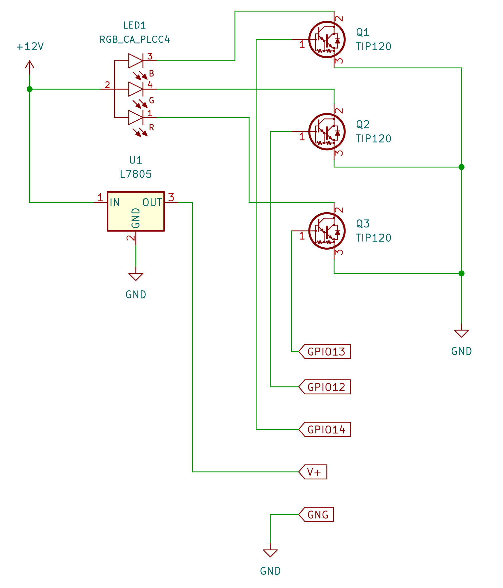

# ESP8266-RGB

An ESP8366 based RGB LED strip controller. 

## Hardware

Here is an example configuration that will work with common anode type LED strips.

- [ESP8622 Microcontroller](https://www.adafruit.com/product/2471)
    - you will need a USB to serial dongle to program the board linked above
      there are [others](https://www.adafruit.com/product/2821) with build in USB to serial
- [RGB LED strip](https://www.adafruit.com/product/346)
- Darlington Pair transistors - I used 3 TIP120
- 5V regulator - I used an L7805
- 12V Power Supply (will need to supply enough current for the LED strip)
- Strip board/ Perfboard (You'll probably want to solder it all together)

## Arduino IDE Setup

### Set Up Board
File -> Preferences

Additional Boards Manager URLs:
`http://arduino.esp8266.com/stable/package_esp8266com_index.json`

Tools -> Board -> Boards Manager

search `esp8266` and install `esp8266 by ESP8266 Comunity`

Tools -> Board

select Adafruit Feather HUZZAH ESP8266

### Set Up Libraries
Tools -> Manage Libraries
* Adafruit_GFX
* Adafruit_SH110X
* Adafruit_SCD30
* Sensirion I2C SCD4x
* ArduinoJson

### Compile and Upload
At this point you should be able to compile and upload the sketch

### WIFI Configuration
You may either enter you WIFI credentials in Secrets.h prior to compilation or
you can connect to the device as an access point via the directions printed to the
serial console on boot.

# Developing Web interface

`npm run dev`

runs a node server on `http://localhost:3000` and redirects REST calls to your Feather HUZZAH connected to
your network. you can set the IP of your feather HUZZAH in the DevENV.html file.

`npm install html-minifier -g`

`npm install uglifycss -g`

`npm install uglifyjs -g`

then build with `bash build.sh`

This creates ./src/MushroomSense/Webpage.h that will contain several c byte arrays. Each representing
one of the web assets gziped and ready to serve to a client from the esp server.
